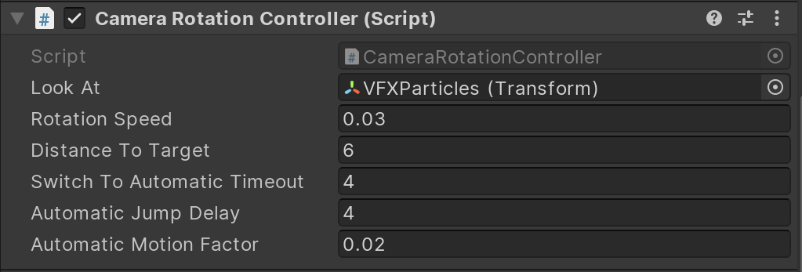

# Cluster Display Graphics Demo

This project uses Cluster Display and HDRP (custom version as of today).
It provides a simple demo scene letting users try out the following features:
* Skinned Mesh Animation.
* VFX Graph Particles.
* Legacy Particles (Shuriken).
* Additive Scene Loading.

The project comes with two scenes:
* **Main**: main scene holding camera, particles, skinned mesh.
* **SpinnyCube**: a very basic scene holding a procedurally animated cube, meant to be additively loaded to the main scene.

## Camera Controls

The camera comes with a custom controller, allowing it to move around a target while looking at it. It also allows for sudden changes in camera position (jumps), meant to validate that camera cuts behave properly.

This controller responds to user input, and will otherwise animate the camera automatically. Automatic behavior includes movement and jumps.

#### Input
* Use arrows to move around the target.
* Press "J" to jump.

#### Exposed fields

* **Look At**: the **Transform** the camera will look at.
* **Rotation Speed**: speed at which the camera rotates around the target.
* **Distance To Target**: distance between the camera and its target.
* **Switch To Automatic Timeout**: Timeout beyond which the controller switches to automatic mode if no input is detected.
* **Automatic Jump Delay**: Delay between automatically triggered jumps.
* **Automatic Motion Factor**: In automatic mode, arrows input is simulated. This factor allows to control the amount of camera movement.
