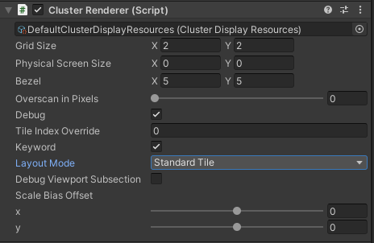

TODO
* mention we don't support lens flare or panini projection (yet)

# About Unity.ClusterDisplay.Graphics
See the core [Cluster Display package](https://github.com/Unity-Technologies/ClusterDisplay/source/com.unity.cluster-display/Documenation~/index.md) for general information, installation, and usage of Cluster Display.

## Package status
This package is available as a preview, and is actively being developed, so it is not ready for production use. The features and documentation in this package might change before release.

## Package contents
The following table describes the package folder structure:

|**Location**|**Description**|
|---|---|
|*Documentation~*|Contains package documentation.|
|*Runtime*|contains cluster display graphics components and utilities|
|*Editor*|contains ClusterRenderer custom inspector.|

## Installation
This package is currently not available through Unity's Package Manager as it is still experimental. It should be referenced in the user project's `Packages/manifest.json` file using a relative path such as (for example): 

`"com.unity.cluster-display.graphics": "file:../../Packages/com.unity.cluster-display.graphics"`

We suggest using [Git Submodules](https://git-scm.com/book/en/v2/Git-Tools-Submodules
) to download the package to more easily update.

## Requirements
Cluster Display Graphics depends on URP or HDRP 14.0.3 (Unity 2022.2 and above). Install either "Universal RP" or "High Definition RP" from the package manager.

This package also has a dependency on [com.unity.cluster-display](https://github.com/Unity-Technologies/ClusterDisplay/source/com.unity.cluster-display) for the core Cluster Display functionality.

## Cluster Display Graphics Concepts

We call the pixel surface subsection rendered by each machine a **tile**.
We describe the target pixel surface as a **grid** of displays, with the size expressed in tiles. For example, a 3x3 grid size would output to 9 displays. Note that for the time being, we assume displays all have the same dimensions and are arranged as a regular 2D grid without any gap.

#### Asymmetric Projection

We subdivide the viewport into tiles, based on the grid size. We index those tiles row by row, starting at the top left corner of the grid (tile index 0). The tile index is inferred from the Cluster Display state (see [com.unity.cluster-display](https://github.com/Unity-Technologies/ClusterDisplay/source/com.unity.cluster-display)). Note that it is possible to manually take control of the tile index and the viewport subsection for debugging purposes. 

In the figure below, we visualize a camera frustum sliced as a 2x2 grid; the frustum of the `tileIndex = 0` slice is highlighted in blue.


#### Overscan

Many effects compute a pixel's value based on its neighbors (think of blur for example). To allow for seamless tiling, we slightly expand the frustum/viewport, so that each pixel of the original viewport has access to its neighbors. Those additional pixels are cropped out of the final output after effects have been computed.


#### Cluster Display Space

Some screen space computations need to happen at the scale of the global cluster output rather than in each machine's local screen space. We therefore introduce the notion of `Cluster Space`.

In the illustration below, we imagine a cloud is to be placed in screen space on a 2x2 grid. On the left, each machine places the cloud with respect to its local screen space coordinates. On the right, all machines place the cloud at the same place as the computation occurs in `Cluster Space`.


*Above figure uses an icon from [FreePik](https://www.flaticon.com/authors/freepik)*

#### Physical Screen Size And Bezel

In case the displays being used have bezels, those need to be taken into account to adjust the projection. Both values represent physical units (mm) and should not be confused with screen size (expressed in pixels).


## Supported Effects

The following effects do not require any adaptation to be Cluster Display compatible:

* Channel Mixer
* Film Grain (provided a tileable texture is used)
* Lift, Gamma, Gain
* Split Toning
* White Balance
* Tonemapping
* Color Curves
* Color Adjustments
* Shadows, Midtones, Highlights
* Fast Approximate Anti Aliasing (FXAA)
* Enhanced Subpixel Morphological Antialiasing (SMAA)
* MSAA 
* Subsurface Scattering

The following effects rely on this package for Cluster Display support:

| **Effect** | **Uses Overscan** | **Uses Cluster Display**|
|----|----|----|
| Bloom | yes | - |
| Vignette | - | yes |
| Motion Blur | yes | - |
| Chromatic Aberration | - | yes |
| Depth of Field | yes | - |
| Lens Distortion | yes | yes |
| Temporal Anti Aliasing | yes | - |
| Ambient Occlusion | yes | - |

Note that for effects relying on overscan, there is a correlation between the amount of overscan and the maximal intensity of the effect before noticeable artefacts appear. A balance is to be found between the amount of overscan (which increases rendering cost) and the intensity of an effect according to an artistic intent.

Let's consider Bloom for example, in the capture below, bloom works with overscan:


However, if we use a high *scatter* value, artefacts become apparent despite overscan:


**Volumetric lighting** is still under investigation and updates will be provided later.

## Using Unity.ClusterDisplay.Graphics

#### ClusterRenderer
To enable Cluster Display graphics features for a project, add a `ClusterRenderer` component to the scene to be displayed. Only one component of that type is expected to be active at any given time. The `ClusterRenderer` component is responsible for managing projection, overscan and activation of Cluster Display-specific shader features (in HDRP). It also offers some debugging features. This component comes also has a custom inspector.

In normal mode, the inspector exposes `Grid` size, `Physical Screen Size`, `Bezel` and `Overscan`. If no bezel is needed both fields can be safely ignored. Leaving `Physical Screen Size` to zero simply bypasses bezel.


When `Debug` is enabled, some debugging options are available:



* **Tile Index Override**: the tile index is typically inferred from the synchronization/networking API, but this field lets users manually override the tile index for debugging purposes. The tile displayed by the machine may be manually changed at runtime. Please note that this override is always used when debug mode is active.

* **Enable Keyword**: a shader keyword is used to enable/disable Cluster Display related shader features (implemented in HDRP and user code). Toggling this at runtime lets users compare *normal* vs. *Cluster* rendering. Useful for validating Cluster-specific shader modifications.

* **Layout Mode**: Setting the layout mode allows you to switch between **tile** which previews what a single node will render, and the stitcher mode which enables a single machine to render **all** cluster tiles and compose them appropriately. This allows users to preview the full cluster output without deploying on actual cluster hardware. Please keep in mind that tests on actual cluster hardware are still necessary as the stitcher does not replicate all cluster behavior. For example, with the stitcher, there is only one update and one camera render per tile, while on actual cluster hardware there will be one update followed by one camera render on each cluster machine.

* **Bezel Color**: This allows you to manipulate the color of the bezels in between the tiles, this can be handy for debugging.

Users can take control of the viewport subsection rendered by the machine. In that case, the tile index is bypassed and the rectangle corresponding to the viewport subsection can be tweaked directly.


* **Scale Bias Offset**: one of the most relevant features provided by the package is overscan. By tweaking the sliders, users can visualize pixels that are outside the final render, that is, overscanned pixels. This is helpful when debugging edge artefacts.

#### Command Line Arguments

Some parameters may be passed as command line arguments to a Unity application using this package, in which case they override the project's settings.
We support the following arguments:

* `--debug` start the cluster renderer in debug mode
* `--gridSize` cluster grid size, argument passed as `[columns]x[rows]` (example: `4x2`)
* `--overscan` amount of overscan in pixels passed as an integer
* `--bezel` bezel size in mms, passed as `[horizontal]x[vertical]` (example: `24x32`)
* `--physicalscreensize` physical screen size in mms, passed as `[width]x[height]`

#### Shading Features

Cluster Display shading features are enabled when using the ClusterRendering to manage rendering. The rendering pipeline provides the following macros:

* `SCREEN_COORD_APPLY_SCALEBIAS`: converts full screen UV coordinates to cluster space.
* `SCREEN_COORD_REMOVE_SCALEBIAS`: inverse of `SCREEN_COORD_APPLY_SCALEBIAS`
* `SCREEN_SIZE_OVERRIDE`: size of the pixel surface formed by the grid of displays.

## Cluster Display Graphics Tips

#### Artefacts On Cut

On camera cuts, make sure the volumetric history and color pyramid are reset to prevent artefacts.
```
HDCamera hdCam = HDCamera.GetOrCreate(cam);
hdCam.Reset();
hdCam.volumetricHistoryIsValid = false;
hdCam.colorPyramidHistoryIsValid = false;
```

#### Operating System Overlays

Whenever you have operating system managed overlays (toolbar, window) on top of your full screen Unity application, a one frame delay may be introduced causing cluster synchronization artefacts.

#### Shader Stripping

The screen coord override variants needed for fullscreen post effects should not be stripped
when building a standalone player. Make sure the "Strip Screen Coord Override Variants" option
in **Project Settings | Graphics | Global Settings** is unchecked.