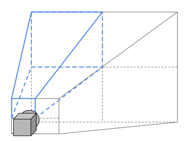
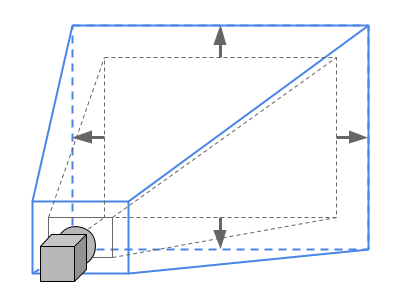
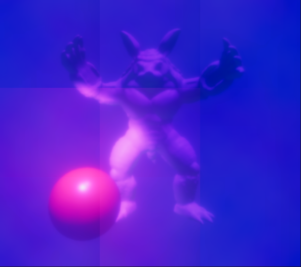

# Tiled Projection Concepts

We call the pixel surface subsection rendered by each machine a **tile**.
We describe the target pixel surface as a **grid** of displays, with the size expressed in tiles. For example, a 3x3 grid size would output to 9 displays. Note that for the time being, we assume displays all have the same dimensions and are arranged as a regular 2D grid without any gap.

## Asymmetric Projection

We subdivide the viewport into tiles, based on the grid size. We index those tiles row by row, starting at the top left corner of the grid (tile index 0). The tile index is inferred from the Cluster Display state. Note that it is possible to manually take control of the tile index and the viewport subsection for debugging purposes.

In the figure below, we visualize a camera frustum sliced as a 2x2 grid; the frustum of the `tileIndex = 0` slice is highlighted in blue.

## Overscan

Many effects compute a pixel's value based on its neighbors (think of blur for example). To allow for seamless tiling, we slightly expand the frustum/viewport, so that each pixel of the original viewport has access to its neighbors. Those additional pixels are cropped out of the final output after effects have been computed.

## Cluster Display Space

Some screen space computations need to happen at the scale of the global cluster output rather than in each machine's local screen space. We therefore introduce the notion of `Cluster Space`.

In the illustration below, we imagine a cloud is to be placed in screen space on a 2x2 grid. On the left, each machine places the cloud with respect to its local screen space coordinates. On the right, all machines place the cloud at the same place as the computation occurs in `Cluster Space`.

*Above figure uses an icon from [FreePik](https://www.flaticon.com/authors/freepik)*

## Physical Screen Size And Bezel

In case the displays being used have bezels, those need to be taken into account to adjust the projection. Both values represent physical units (mm) and should not be confused with screen size (expressed in pixels).

## Supported Effects

The following effects do not require any adaptation to be Cluster Display compatible:

* Channel Mixer
* Film Grain (provided a tileable texture is used)
* Lift, Gamma, Gain
* Split Toning
* White Balance
* Tonemapping
* Color Curves
* Color Adjustments
* Shadows, Midtones, Highlights
* Fast Approximate Anti Aliasing (FXAA)
* Enhanced Subpixel Morphological Antialiasing (SMAA)
* MSAA 
* Subsurface Scattering

The following effects rely on this package for Cluster Display support:

| **Effect** | **Uses Overscan** | **Uses Cluster Display**|
|----|----|----|
| Bloom | yes | - |
| Vignette | - | yes |
| Motion Blur | yes | - |
| Chromatic Aberration | - | yes |
| Depth of Field | yes | - |
| Lens Distortion | yes | yes |
| Temporal Anti Aliasing | yes | - |
| Ambient Occlusion | yes | - |

Note that for effects relying on overscan, there is a correlation between the amount of overscan and the maximal intensity of the effect before noticeable artefacts appear. A balance is to be found between the amount of overscan (which increases rendering cost) and the intensity of an effect according to an artistic intent.

Let's consider Bloom for example, in the capture below, bloom works with overscan:

However, if we use a high *scatter* value, artefacts become apparent despite overscan:

**Volumetric lighting** is still under investigation and updates will be provided later.
