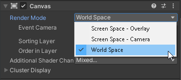
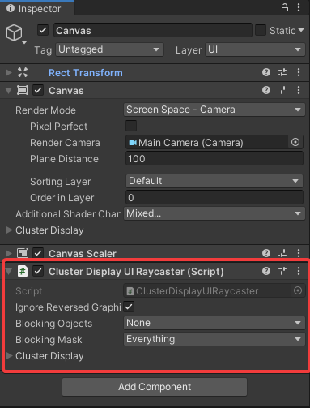
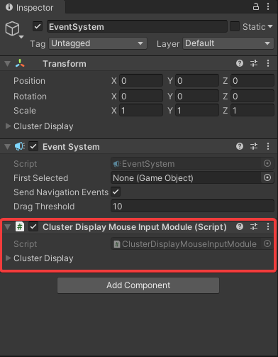

# Cluster Display and UGUI
Cluster display supports almost all features of UGUI. However, some additional steps are required.

## Render Mode
Cluster Display only supports the following render modes:

- Screen Space - Camera
- World Space

In order to support **Screen Space - Overlay** modifications would need to be made to UGUI to excplitly clip/crop the UGUI render to specific sections of the GUI. Furthermore, if Cluster Display is NOT setup to use the XR API from the custom graphics branch, cluster display will instead leverage a canvas configured to the **Screen Space - Overlay** render mode to present the rendered image.

## Cluster Display UI Raycaster

This component derrives from the traditional [Graphics Raycaster](https://docs.unity3d.com/Packages/com.unity.ugui@1.0/manual/script-GraphicRaycaster.html) and overrides the built-in raycasting implementation. Most of the code was lifted and refactored from EventSystem.RaycastAll and GraphicRaycaster.Raycast and the purpose of refactoring was to remove several restrictions that would have prevented UI working properly in cluster display including the following:
1. Returning no raycasts if the screen point is outside the bounds of the screen.
2. Removing support for multi-display for now.
3. Event camera is always present.
4. Simplified for easier management.

## Cluster Display Mouse Input Module

The purpose of this component is to provide the following:
- Basic mouse support for UGUI in cluster display.
- Demonstrate how to build a cluster display supported custom input module that can receive input from custom devices and sources.
