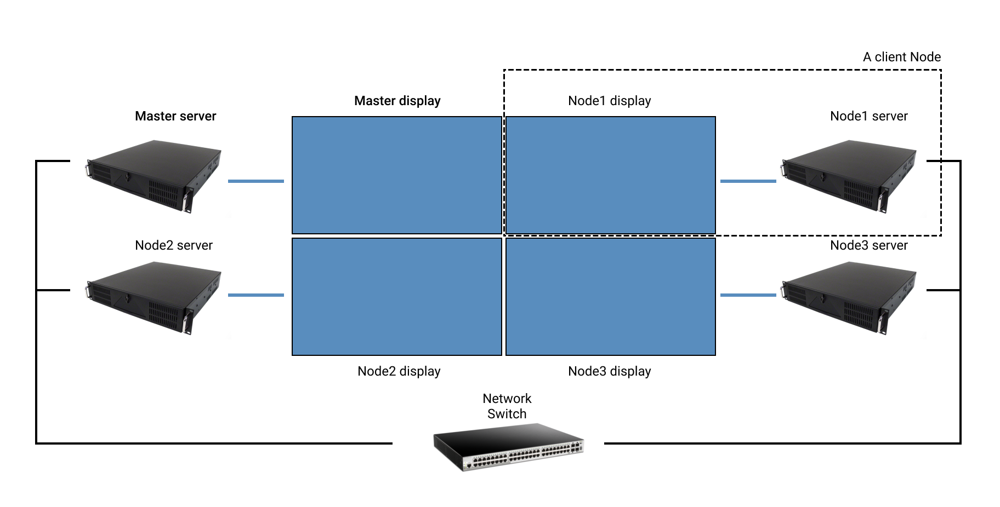
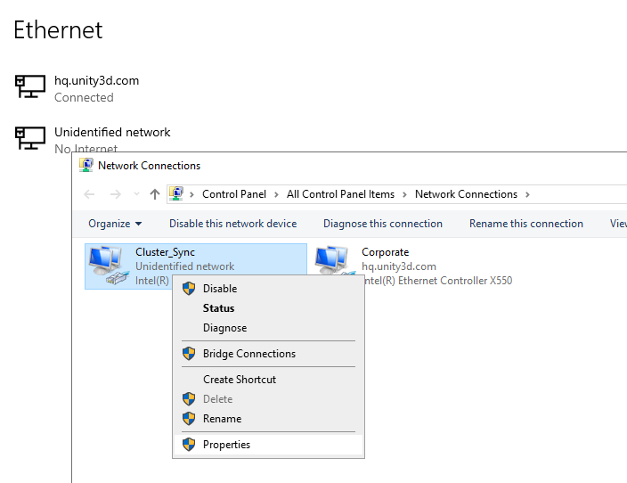

# Hardware Setup

Before you start setting up your hardware, you should be aware of the [hardware requirements](index.md#hardware) and review the section about [hardware tested by Unity](reference.md#tested-hardware).

Set up your Cluster Display Hardware elements according to the following
graphical representation (example for a 2x2 screen matrix):

To summarize:

-   A node in the cluster consists of a workstation and a display output.

-   There is one Master Node and multiple client nodes (here, 1 master and 3 clients).

-   You can set up the Master as a rendering node to optimize the use of your hardware resources.

-   The client nodes connect to the Master Node via a wired Local Area Network.

Additional recommendations:

-   Use an enterprise-grade switch. Communication is done via UDP multicast, which requires a large bandwidth.

-   Do not use routing. The UDP packets are sent with TTL1 (time to live), which prevents routing from working.

### Adding Metric on Network interface used by Cluster

If the servers you are using in the Cluster have multiple Network Interface Controllers connected, you must set Metrics on the Network Interface used by the Cluster in order to make sure that all nodes on the Cluster use the same Network Interface to communicate. To do this in Windows 10, follow these steps **for all nodes in the cluster**:

1.  Open the Control Panel.

2.  Right-click on the network interface being used for Cluster messaging:

    

3.  Click **Properties** in the context menu.

4.  Once the Properties window is open, select **Internet Protocol Version 4** and click **Properties.**

5.  Select **Advanced** at the bottom right. In the **Advanced TCP/IP Setting**, enter “1” in the **Interface metric** field.

    
