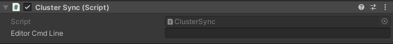
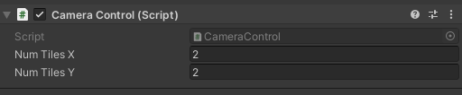
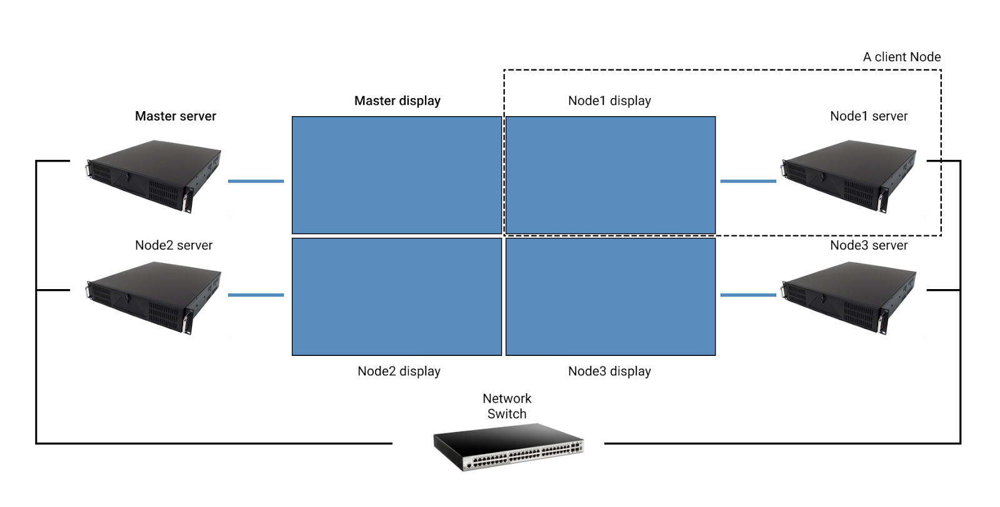
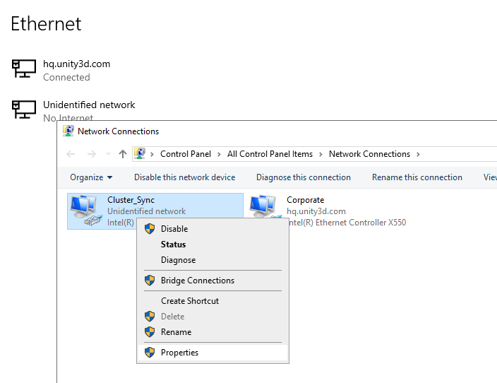
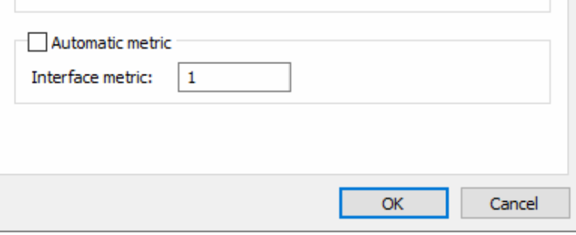
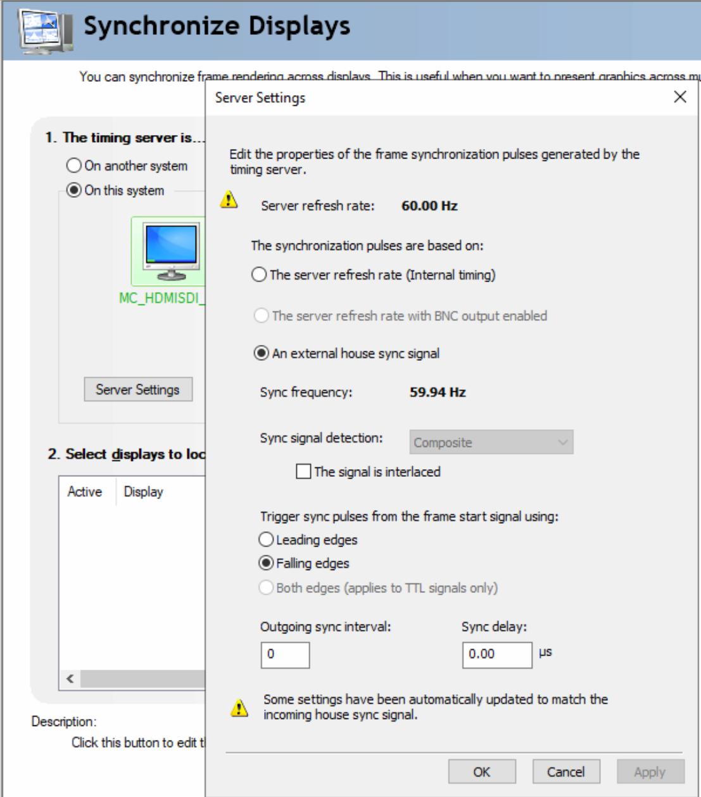

# About Cluster Display

Cluster Display technology allows multiple machines to run the same Unity scene in sync. This feature enables you to deploy your Unity project to large/multi-display configurations.

One machine may feed multiple displays, but this approach is necessarily limited by the machine's computational power. With Cluster Display, one can scale up to an arbitrary number of machines, therefore an arbitrary number of displays (currently we support up to 64 nodes but can be increased easily). Note that Cluster Display does not prevent the use of multiple displays per machine. The number of displays a machine may feed depends both on its hardware capabilities and the user project's complexity.

Typically, each cluster node runs the same interactive content in lockstep, but only renders a subsection of the total display surface.

Note that making cluster-enabled builds with Unity requires a special license. Contact a sales rep for more information.

# Experimental package

This package is available as an experimental package, so it is not ready for production use. The features and documentation in this package *will* change before it is verified for release.

# Installation

This package is currently not available through Unity's Package Manager as it is still experimental. It should be referenced in the user project's Packages/manifest.json file using a relative path. See [Installing a package from a local folder](https://docs.unity3d.com/Manual/upm-ui-local.html).

`"com.unity.cluster-display.cluster-display": "file:../../Packages/com.unity.cluster-display.cluster-display"`

We suggest using [Git Submodules](https://git-scm.com/book/en/v2/Git-Tools-Submodules) to download the package to more easily update.

# Requirements

This version of Cluster Display is compatible with the following versions of the Unity Editor:

* 2020.1 and later (required)

Cluster Display is currently only supported on Windows 10

**Hardware sync**

Currently the Cluster Display solution works best with [NVIDIA Quadro Sync II](https://www.nvidia.com/en-us/design-visualization/solutions/quadro-sync/) hardware to lockstep the signal.

# Known limitations

There are a number of features that are not currently supported in Cluster Rendering out-of-the-box due to either **1)** a reliance on screen-space or viewport data (e.g. Bloom post processing), and/or **2)** a dependence on data that can not be synced over the network in a reliable or performant way (e.g. physics).

- There is currently no support for syncing events from the new Input System package
- Many HDRP post-processing effects are not supported and require special support. See the [Cluster Display Graphics package documentation](https://github.com/Unity-Technologies/com.unity.cluster-display.graphics/blob/develop/Documentation~/index.md) for more details

- Physics is not supported as simulations aren’t deterministic across machines
- HDRP auto-exposure is not supported
- UGUI, IMGUI and UI Elements are not supported for display or interaction across displays
- Video Player playback is not supported across displays

# Using Cluster Display

## Project setup steps

1. Add the **ClusterSync** component to a game object to the main scene to enable internal state synchronization

2. Add a component for domain decomposition dependent on the render pipeline

3. Add the **CameraControl** component from the Utils folder to a game object in the main scene to enable domain decomposition (mapping of rendering node ID to camera subregion)

4. Add the **ClusterQuitBehaviour** component from the Utils folder to a game object in the main scene to enable manual and timeout-based cluster shutdown

5. Update Unity editor project settings to recommended settings below in the [**Unity Project Settings**](https://docs.google.com/document/d/1vllT04xXonsaCjpbpwIzPjgzz9nzVTu-lyYiB6mmdFs/edit#heading=h.jip43uowngr4) section

## Other

**Beware of Operating System Overlays**

Whenever you have operating system managed overlays (toolbar, window) on top of your fullscreen Unity application, a one frame delay may be introduced causing cluster synchronisation artefacts.

**Seed VFX Graph Particles**

When using VFX Graph particles effects in HDRP, make sure the **Reseed on play** checkbox on the **VisualEffect** component is left unchecked, otherwise different nodes may end up with differently seeded random number generators leading to visual artefacts.

# Advanced topics

## Internal state synchronization

State synchronization and lockstep rendering are provided by the **ClusterSync** component.

Note that **ClusterSync** requires specific command line arguments to function. Those command line arguments are detailed in the [**Launching the cluster**](https://docs.google.com/document/d/1vllT04xXonsaCjpbpwIzPjgzz9nzVTu-lyYiB6mmdFs/edit#heading=h.n1qu0pguhgyc) section.

For debugging purposes, it is possible to run the editor as a cluster node. To do so, the **Editor Cmd Line** field on the **ClusterSync** component should be populated with the command line arguments that would normally be used to run a standalone build. This field can be left blank otherwise. Note that if other cluster nodes fail to respond, the editor might hang.

## Domain decomposition

Typically, each rendering node maps its ID to a subsection of the global camera frustum.

The Utils folder contains the **CameraControl** component, a sample script that implements the asymmetric frustum projection used in typical LED wall applications. 

This script alters the main camera’s projection matrix to match the desired frustum. The parameters are the number of tiles along X and Y (2 x 2 by default). The tiles are ordered in increasing order from left to right and top to bottom.

An extensive HDRP-specific solution to domain decomposition can be found in the [Cluster Display Graphics package](https://github.com/Unity-Technologies/ClusterDisplay/tree/stable/source/com.unity.cluster-display.graphics).

## Quitting the Cluster cleanly

The **Cluster.Display-Utils** package implements the **ClusterQuitBehaviour** component. This quits the whole cluster then the keyboard shortcuts **Q** and **K** are pressed (keyboard needs to be connected to the master). The component is also responsible for stopping the whole cluster in case the nodes need to quit because of cluster communication timeouts (see [Launching the cluster](https://docs.google.com/document/d/1vllT04xXonsaCjpbpwIzPjgzz9nzVTu-lyYiB6mmdFs/edit#heading=h.n1qu0pguhgyc) for more information about timeouts).

## Unity Project Settings

**IL2CPP**

We strongly recommend building with **IL2CPP backend** (**ProjectSettings->Player->OtherSettings->ScriptingBackend**) 

**V Sync**

In **Project Settings > Quality**, set **V Sync Count** to **Every V Blank**

**Incremental GC**

It is recommended that you enable [Incremental GC](https://blogs.unity3d.com/2018/11/26/feature-preview-incremental-garbage-collection/) to help avoid framerate jitters caused by garbage collection. 

`ProjectSettings->Player->OtherSettings->UseIncremental GC`

**Fullscreen**

Set Fullscreen Mode to Exclusive Fullscreen in [Standalone Player Settings](https://docs.unity3d.com/Manual/class-PlayerSettingsStandalone.html). It’s recommended to force the settings as command line arguments as previous resolutions/fullscreen settings are persistent from one run to another through the Windows Registry. For example:

**.\ClusterRenderTest.exe -window-mode exclusive -screen-width 1920 -screen-height 1080 -screen-fullscreen 1**

See [StandaloneBuildArguments](https://docs.unity3d.com/Manual/CommandLineArguments.html) for a list of accepted arguments (The Unity standalone Player section)

## Preventing screen tearing

- Any active window overlays (e.g. Windows Taskbar, TeamViewer windows, Windows File Explorer) on a node can cause a delay on that node
- Framerate drops cause temporary loss of sync. Experiences must be designed to never drop framerate. In the case that the framerate does drop, you will experience tearing until the target frame rate is achieved again

# Hardware Setup

A Node in the cluster consists of a workstation and a display output. Each workstation runs a copy of the Unity application with Cluster Display enabled. There is one Master Node and multiple client nodes. The client nodes connect to the Master Node via a **wired** Local Area Network. 

- Use an enterprise-grade switch as communication is done via UDP multicast, which requires a large bandwidth
- The UDP packets are sent with TTL1 (time to live), so routing will not work
- We recommend using the Master Machine as a rendering node
- The solution is Windows 10 only

### Adding Metric on Network interface used by Cluster

If the servers you are using in the Cluster have multiple Network Interface Controllers connected, you must set Metrics on the Network Interface used by the Cluster in order to make sure that all nodes on the Cluster use the same Network Interface to communicate. To do this in Windows 10, follow these steps **for all nodes in the cluster**:

1. Open the Control Panel
2. Right-click on the network interface being used for Cluster messaging
3. Click **Properties** in the context menu

4. Once the Properties window is open, select **Internet Protocol Version 4** and click **Properties**
5. Select **Advanced** on the bottom right. In the **Advanced TCP/IP Setting**, enter “1” in the **Interface metric** field.

# Unity Cluster Display under the hood

To start a Cluster Display group, you should: 

1. Start the master and all client machines at the same time
2. Launch the application on each machine with the specific command line argument to define the master and client relationship (see Deploying a Unity Cluster below)
3. The master node will then sync all the client nodes with itself 

This synchronization method is known as frame locking, or “lockstep” synchronization. This means the master node will propagate an “update” signal with its internal state to all client nodes, signaling them to render a frame. The next “update” is not sent unless all clients reported the completion of their previous workload.

The master node also synchronizes the following data: 

- TimeManager data: Time.deltaTime, Time.unscaledDeltaTime, etc. (note that Time.realTimeSinceStartup is not synchronized and its use should be avoided)
- Random number internal state
- Input events from the master: keyboard, mouse, etc.

The application should only use synced data types to update the client state. This will ensure the application simulates identically across the master and all client nodes. 

The data payload that gets synchronized between the master and client nodes each frame is constant, regardless of the number or complexity of objects in the scene. This means the complexity of the scene does not have an impact on network performance, only the individual rendering performance of each node.

# Splitting the displays across multiple machines

With all client nodes synchronized to the master node in the cluster, you must organize the nodes so that each one is rendering an offset portion of the overall view. The synchronization data does not include information about the Camera, so you are free to manipulate the camera individually in each node. Since all nodes are simulating the same scene, the key is to manipulate the camera properties so that each node is rendering the correct portion of the overall display.

How to achieve this depends on how the multiple physical screens are set up, but the basic approach is to assign a different projection matrix to each node’s camera. See[ Camera.projectionMatrix](https://docs.unity3d.com/560/Documentation/ScriptReference/Camera-projectionMatrix.html) for more information on how to do this.

# Deploying a Unity Cluster

## Building the Player

There are no special techniques involved in the build process. As long as you build the player with a Unity editor with the proper license, the player will have the Cluster-enabled features.

## Launching the cluster

Once all files are copied onto the machines, start the executable with the appropriate command line arguments (on Windows 10 you can use **PSExec** to run the command from an external machine).

The mandatory command line arguments for a cluster-enabled executable is:

**<binaryName> -<nodeType> <nodeIndex> <number of clients> <multicast address>:<outgoing port>,<incoming port>** 

**<binaryName>** Path of the Unity executable

  **<nodeType>** Indicate master or client node 

**-masterNode** or **-node**

  **<nodeIndex>** Node index

**<number of clients>** Number of client nodes in the cluster (Without the Master). This is mandatory for the master node and should be omitted for the clients. Maximum number of clients in the current implementation is 63.

**<multicast address>** Multicast address used by Cluster Sync messages.

**<outgoing port>** Port used by Client to send ACK messages.

**<incoming port>** Port used by Cluster to receive sync messages

Example of a command to run on the Master Node with 3 client nodes:

**Demo.exe -masterNode 0 3 224.0.1.0:25689,25690**

Example of a Cluster Display command line for the first client node:

**Demo.exe -node 1 224.0.1.0:25690,25689**

Here a sample of all commands used on a 4 servers cluster (Master + 3 clients):

**Demo.exe -masterNode 0 3 224.0.1.0:25689,25690****Demo.exe -node 1 224.0.1.0:25690,25689****Demo.exe -node 2 224.0.1.0:25690,25689****Demo.exe -node 3 224.0.1.0:25690,25689**

### Timeouts

The communication between the master and the clients happens in 2 phases, initial handshake and ongoing synchronization.

**Handshake**

- When the server node starts, it waits for the specified number of clients to connect
- When the client nodes start, they advertise their presence and wait until a server accepts them into the cluster

**Synchronization**

After the initial handshake occurs, all nodes switch into a regular lockstep rendering phase that lasts until the end of the simulation. 

The 2 phases have different timeout settings controlled by the following optional command line arguments:

**handshakeTimeout** 

- Timeout during the handshake phase in **milliseconds**. Default value is 30000 (30 seconds)
- The server node waits at most this amount of time for nodes to register, and continues with the current set of nodes
- The server node quits if no client nodes are present by the end of the timeout
- The client nodes quit if no server node accepted them in a cluster after this amount of time

**communicationTimeout** 

- Timeout during the regular lockstep rendering phase in **milliseconds**. Default value is 5000 (5 seconds)
- The server node waits this amount of time before kicking out an unresponsive node from the cluster
- The client nodes wait this amount of time for an unresponsive server node, before quitting
- It is recommended to set the communication timeout a bit lower on the server node (e.g. 4000) compared to the client nodes (e.g. 5000) to prevent an avalanche quit phenomenon where the server node needs to kick out unresponsive nodes faster than the client node’s timeout

#### Command line examples

Master Node with 3 clients:

**Demo.exe -masterNode 0 3 224.0.1.0:25689,25690 -handshakeTimeout 30000 -communicationTimeout 5000**

First client node:

**Demo.exe -node 1 224.0.1.0:25690,25689 -handshakeTimeout 30000 -communicationTimeout 6000**

# Input for Cluster Display

Input events from the InputManager will be automatically synced across the network.

**Note that input will not be properly processed by UI elements spanning multiple displays.**

# Tested Hardware

We have tested the solution with the hardware and configuration detailed below.

## Components

- 4 x [Supermicro SuperServer 1019GP-TT](https://www.supermicro.com/en/products/system/1U/1019/SYS-1019GP-TT.cfm) with:

- - NVIDIA Quadro P6000 GPU
  - NVIDIA Quadro Sync II Kit for Pascal Quadro
  - 1x Intel Xeon Gold 5122 3.6GHz Quad-Core Server CPU
  - 4x 16GB DDR4 2666Mhz ECC (64GB total)
  - 1x Samsung 970 Pro 512GB m.2 SSD

- 1x [Blackmagic Design MultiView 16](https://www.blackmagicdesign.com/ca/products/multiview/techspecs/W-MVW-01)

- 16x [Blackmagic Design Mini Converter SDI to HDMI 6G](https://www.blackmagicdesign.com/ca/products/miniconverters/techspecs/W-CONM-27https://www.blackmagicdesign.com/ca/products/miniconverters/techspecs/W-CONM-27)

- 16x [DisplayPort to HDMI cables](https://www.accellww.com/products/displayport-1-2-to-hdmi-2-0-adapter) (6ft)

- 16x SDI cables (6ft)

- 8x Cat 5 ethernet cables (6ft)

- 1x HDMI cable

- 1x Sony 55" 4K UHD HDR OLED Android Smart TV (XBR55A9G)

## Configuration

**OS**

Windows 10 Enterprise version 1903

**Network**

Every server is connected to two NICs (Network Interface Controller): 

- Build management (VM, copying and executing scripts) 
- Dedicated Cluster Display sync network

**Graphics Card**

- Nvidia driver: 431.94 

- Resolution set to 1080p60.

- Nvidia Sync Master set to the same machine as Cluster Display master cluster node

- **NVIDIA Control Panel** settings set to recommended settings for NVIDIA Sync:

- - **3D Settings > Manage 3D Settings > Global Preset** set to **Workstation App–Dynamic Streaming** 
  - **Vertical Sync** set to **Use the 3D Application Settings**. Note: must set Unity project to use V Sync

- For the Nvidia Sync card setup, in the **Nvidia Control Pane**l:

- - **Synchronize Display** set to **On this System** for the master sync server and set to **On Another System** on all clients
  - Verify the display to sync is set correctly (currently only one display is used on all clients)
  - Set the frame rate to 60Hz

- For the ethernet sync connection, Nvidia recommends the following connection diagram:

- Note that **daisy-chaining all servers from one port is not recommended**
- Do not connect the NVIDIA Quadro Sync port to a switch; connections need to be machine-to-machine

**Multiviewer**

- **Server Settings** in the **Nvidia Control Panel** of the master server set to **An External House Sync Signal**

Since both the Multiviewer and Nvidia Quadro Sync have reference input capability, we are using a tri-level sync generator from Black Magic to feed the reference signal to both the Multiviewer and Sync card. The tri-level sync is set to 59.94Hz.

**Note that to initialize the sync, or reinitialize after a reboot, all clients MUST be rebooted BEFORE the master sync server**

- Since we use a Multiviewer, every server is output through DisplayPort and then converted to HDMI. The HDMI signal then goes to a Black Magic Design mini-converter and converted to SDI which goes directly in the Multiviewer.