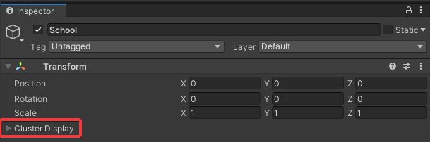
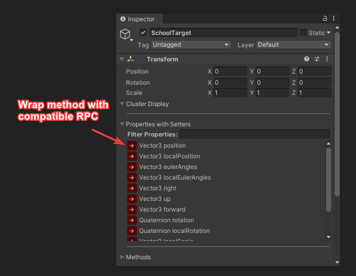
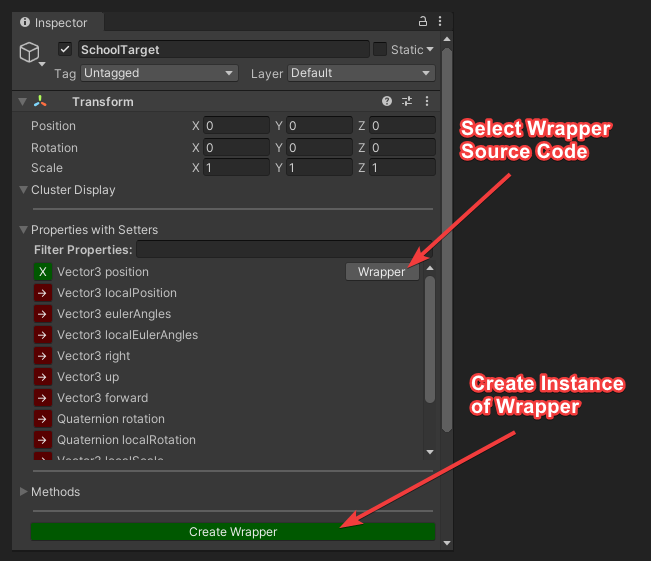
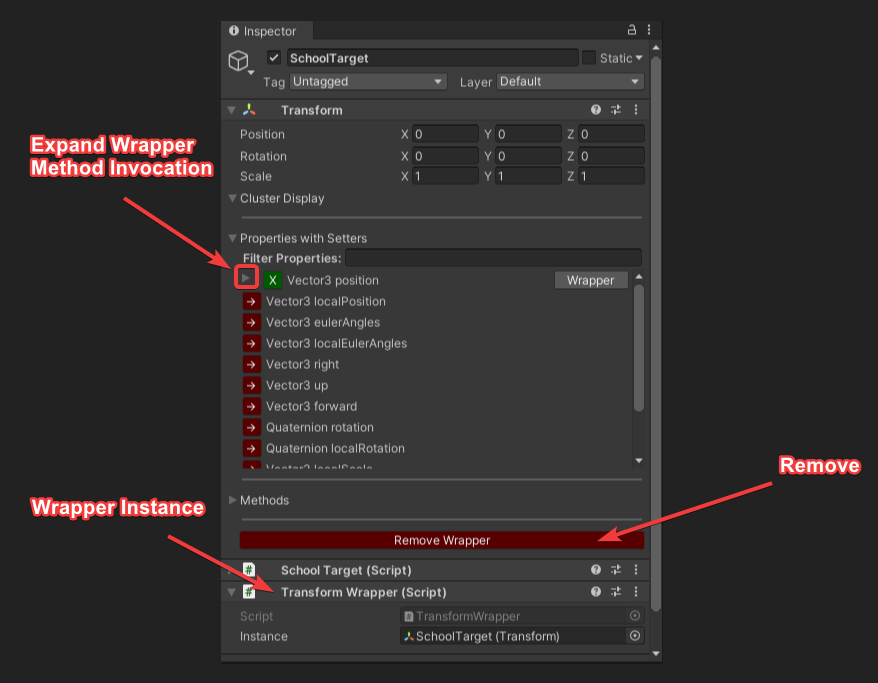

# Network Events
Cluster Display has a multicast UDP general networking library with the following features:
- RPC (Remote Procedural Call) support.
  - Primitive method parameters such as float, int, byte, etc.
  - Struct or valuetype method parameters.
  - Array method parameters.
  - string method parameters.

# RPCs (Remote Procedure Calls)
[RPCs](https://en.wikipedia.org/wiki/Remote_procedure_call) are a common networking pattern for propgating network events and for Cluster Display we use them extensively. In Cluster Display's networking implementation you can flag a method to be an RPC using two different approaches:
- Cluster Display Inspector UI.
- **[ClusterRPC]** C# attribute.

## Cluster Display Inspector UI
To improve prototyping experience, you can flag a C# method or property as an RPC in the cluster display UI:



The UI will automatically find all properties and methods within the type inheritance tree that can be flagged as an RPC:


Expanding the methods list will show you all flagged and unflagged compatible methods:


If we open the dropdown for that method we get the following:


You can call/invoke RPC methods from the editor while cluster display is running:


# IL Post Processing
In order to intercept method an properties calls for propagation to repeater nodes, we inject IL into your compiled assembly after your assembly is compiled. Generally the following is injected:
- Intercept Instructions:
  - These instructions intercept method & property calls, interprets their arguments into bytes and propagates the call and arguments to repeater nodes.
- Execution Instructions
  - Cluster display will dynamically generate classes that converts the propagated arguments from bytes into your method/property arguments, then executes them.

It's important to note that some assemblies **are** IL post processable, and some are **not**. Any assemblies that **do not** compile into **`{Project Path}/Library/ScriptAssemblies`** are **not** IL post processable. Such as:
- UnityEngine.CoreModule
- Unity.Timeline
- Any DLLs in the Unity installation folder.

Only assemblies in **`{Project Path}/Library/ScriptAssemblies`** folder are IL post processable. Therefore, if you want to propgate events associated with a non IL post processable assembly, you will need to use [wrappers](#Wrappers).

## Wrappers
As mentioned in the [IL Post Processing](#il-post-processing) section, methods from non IL post processable assemblies need to be wrapped by a compatible method in order to properly propagate those events. For example, we cannot use **Transform.position** as a RPC directly since it lives in the UnityEngine.CoreModule assembly. Instead, we can use a wrapper to intercept our calls to **Transform.position**.

You can wrap methods using the cluster display UI via:



Once the wrapper is compiled, we can create a new wrapper instance:



Here is information about the wrapper instance:



Now when you manipulate and invoke the RPC, it's invoking through the wrapper:


## **[ClusterRPC]** Attribute
The ClusterRPC attribute is a handy way of flagging a method as an RPC, and you can declaring it above or before your method declaration:
```
[ClusterRPC]
public void TestMethod () {}
// OR
[ClusterRPC] public void TestMethod () {}
```
This attribute also provides several optional but handy arguments:
```
public ClusterRPC (RPCExecutionStage rpcExecutionStage = RPCExecutionStage.Automatic, int rpcId = -1, string formarlySerializedAs = "")
```

### **RPCExecutionStage**
By default, cluster display will automatically determine the order which the RPC event was called within the [order of events](https://docs.unity3d.com/Manual/ExecutionOrder.html). You can override the order of **when** this RPC gets executed by the repeater nodes within the frame by using this optional argument. You can read more about this [here]().

### **rpcId**
Cluster display usually automatically determines the IDs of RPCs for you. However, this option allows you to override that ID for whatever reason.

### **formarlySerializedAs**
When you rename a method cluster display will not be able to deserialize the method's signature and setting this string to what the method was previously named as will allow cluster display to deserialize the renamed method.

# RPC Method Parameters
Cluster Display's networking library will automatically determine if your target method can be used as an RPC. If you attempt to flag a incompatible method as an RPC. Cluster Display will log a error explaining the problem.

## Supported Parameters
### Primitive Method Parameters
All [C# primitive types](!https://docs.microsoft.com/en-us/dotnet/csharp/language-reference/builtin-types/built-in-types) can be used as RPC parameters.
```
[ClusterRPC]
public void TestMethod (float valueA, int valueB) {}
```

### Struct & ValueType Method Parameters
[C# structs](!https://docs.microsoft.com/en-us/dotnet/csharp/language-reference/builtin-types/struct) can be used as RPC parameters as long as **all** of the struct members and nested members are primitive types:
```
public struct NestedContainerType
{
    public double valueC;
}

public struct ContainerType
{
    public float valueA;
    public int valueB

    // Nested struct instances are supported.
    public Vector3 vector; // Common Unity structs are supported.
    public NestedContainerType nested; // Custom structs are supported. 
}

[ClusterRPC]
public void TestMethod (ContainerType container, Vector3 vector) {}
```

### Array Method Parameters
C# arrays are supported as long as the element type is a primitive or struct type:

```
public struct NestedContainerType
{
    public double valueC;
}

public struct ContainerType
{
    public float valueA;
    public int valueB

    // Nested struct instances are supported.
    public Vector3 vector; // Common Unity structs are supported.
    public NestedContainerType nested; // Custom structs are supported. 
}

[ClusterRPC]
public void TestMethod (ContainerType[] containers, float[] floats) {}
```

### String Method Parameters
String parameters are supported.
```
[ClusterRPC]
public void TestMethod (string messageStr) {}
```