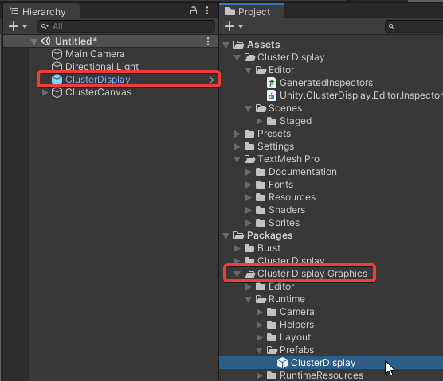
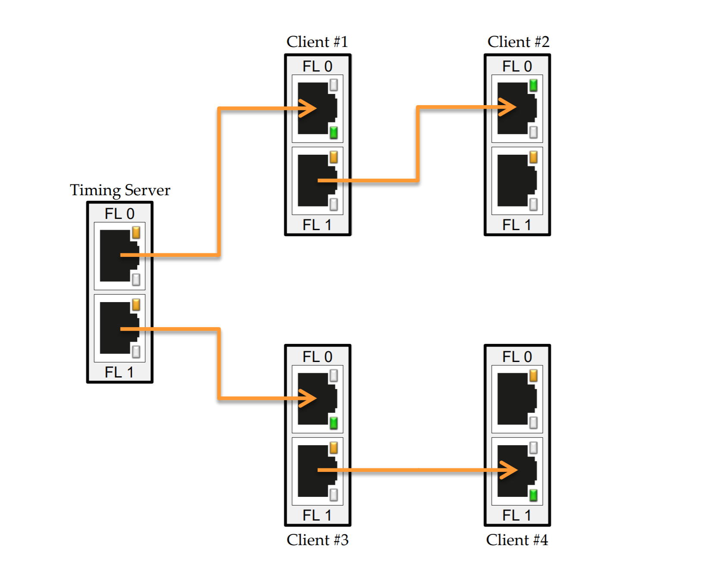

# Quadro Sync
NVIDIA's NvAPI provides the capability to synchronize the buffer swaps of a group of DirectX swap chains when using Quadro Sync II boards. This extension also provides the capability to synchronize the buffer swaps of different swaps groups, which may reside on distributed systems on a network using a swap barrier. It’s essential to coordinate the back buffer swap between nodes, so it can stay perfectly synchronized (Frame Lock + Genlock) for a large number of displays.

Example **WITHOUT** Quadro Sync:


Notice that the camera cuts **are NOT synchronized** across the cluster.

Example **WITH** Quadro Sync:


Notice that the camera cuts **are perfectly synchronized** across the cluster.

## Requirements
* Only supported on DirectX 11 or DirectX 12.
* Requires one or more [NVIDIA Quadro GPU](https://www.nvidia.com/en-us/design-visualization/quadro/)s.
* Requires one or more [NVIDIA Quadro Sync II](https://www.nvidia.com/en-us/design-visualization/solutions/quadro-sync/) boards.
* Windows 10
* Unity 2022.x+

## Recommendations
* Choose a motherboard that supports [IPMI](https://en.wikipedia.org/wiki/Intelligent_Platform_Management_Interface) so you can remotely shutdown, restart and boot your nodes without needing physical access to the machines.
* Place your emitter and repeater workstations on a dedicated network so that other network traffic does not interfer with the cluster.

## Setup
1. Verify that you've added the **ClusterDisplay** prefab to the scene located in **Cluster Display Graphics/Rutnime/Prefabs/ClusterDisplay.prefab**:

    

2. Verify that the **GFXPluginQuadroSyncCallbacks** component is added and enabled:

    

3. Verify that your Unity project has vsync set to **Every VBlank**

    

4. Verify that your Unity project has **Fullscreen Mode** set to **Exclusive Fullscreen**

    

5. **On each node** in the cluster, verify that the display settings **Scale and Layout* option is set to 100%:

    

6. **On each node** in the cluster, setup the following Nvidia Control Panel settings:
   * **3D Settings > Manage 3D Settings > Global Preset** set to **Workstation App–Dynamic Streaming**

    

   * **Vertical Sync** set to **On**. Note: must set Unity project to use V Sync

    

    * Set your desired resolution and frame rate.

    

7. **On the emitter (or master) node**, setup the following Nvidia Control Panel settings and make sure you set the server refresh rate to the HZ all your nodes are running at.

    

8. **On the repeater (or slave) nodes**, setup the following Nvidia Control Panel settings.

    

9. If your using ethernet synchronization with your Quadro Sync cards, use Nvidia's recommendation regarding daisy chaining (**DO NOT CONNECT the ethernet cables to a switch and daisy-chaining all servers from one port is not recommended**):

    

10. Restart the cluster and the monitors for the repeater nodes briefly turn off, then back on after logging into the windows.

11. Run your cluster with the **-window-mode exclusive** command argument to explicitly specify Unity to run in fullscreen exclusive mode.
   * There is an [unexpected issue](https://forum.unity.com/threads/playersettings-are-ignored-when-building-windowed-fullscreen.257700/) where Unity will set a registry key that will override the executable in windowed/borderless if you ran the executable without explictly specifying **-window-mode exclusive**. Therefore, you will need to delete registry entries for the executable. These registry entries are located in:
    **\HKEY_SOFTWARE_USER\SOFTWARE\\{Company Name\}\{Product Name\}**
    <br>
    <br>

    Until we build a better way of resolving this issue, we suggest writing [PSExec](https://docs.microsoft.com/en-us/sysinternals/downloads/psexec) script that will automatically delete those registry entries for you:
    ```
    # On the machine that your managing the cluster
    for($i=41; $i -le 48; $i++) { # Loop through IP address range (41-48) for 192.168.5.*
        echo "Argument: $($args[0])"
        # Change this IP address
        psexec \\192.168.5.$i Powershell "C:\cluster_applications\Tools\delete-reg.ps1 $($args[0])"
        # The script were executing here is placed on each node.
    }
    ``` 
    ```
    # On each node, this script exists somewhere and gets executed by the script on the machine managing the cluster.
    echo "Attempting to delete registry keys in: $($args[0])"
    reg delete "HKCU\Software\$($args[0])" /f
    ```

    Then you execute it via `.\delete-registry-entries.ps1 {Company Name}`

## Multiviewers

 Since both the Multiviewer and Nvidia Quadro Sync have reference input capability, you can use a tri-level sync generator from Black Magic to feed the reference signal to both the Multiviewer and Sync card.

For multiviewers, every server is output through DisplayPort and then converted to HDMI. The HDMI signal then goes to a Black Magic Design mini-converter and converted to SDI which goes directly in the Multiviewer.

## Troubleshooting
You can use [Nvidia's Configure Driver Utility](https://www.nvidia.com/en-us/drivers/driver-utility/) to verify whether Quadro Sync is working as expected. Specifically **option 8.** and **option 11.**


Option 8 will display a little driver debug GUI at the bottom left of any Direct X application.

If it looks like this, then Quadro Sync is working correctly:


However, if it's not working then it will display something like this:


We recommend that you install this on each node within the cluster and setup a [PSExec](https://docs.microsoft.com/en-us/sysinternals/downloads/psexec) script to configure the driver on each node automatically:
```
# On the machine that your managing the cluster
for($i=41; $i -le 48; $i++) { # Loop through IP address range (41-48) for 192.168.5.*
    echo "Argument: $($args[0])"
    # Change this IP address
	psexec \\192.168.5.$i -h powershell "C:\cluster_applications\Tools\set-nvidia-config.ps1 $($args[0])"
    # The script were executing here is placed on each node.
}
```
```
# On each node, this script exists somewhere and gets executed by the script on the machine managing the cluster.
echo $args[0] | C:\cluster_applications\Tools\NvidiaTests\configureDriver.exe
```

## Other Recommendations 

### Operating system overlays – frame delay
Whenever you have operating system managed overlays (e.g. Windows Taskbar, TeamViewer windows, Windows File Explorer) on top of your Fullscreen Unity application, this may introduce a one-frame delay causing cluster synchronization artefacts.

## Framerate drops – screen tearing

Framerate drops cause temporary loss of synchronization, which leads to temporary screen tearing until the framerate is back to the targeted one. For this reason, you should design your project experiences so that the framerate never drops.

## Internal Test Hardware

We have tested the solution with the hardware and configuration detailed below.

### Components

-   4 x [Supermicro SuperServer 1019GP-TT](https://www.supermicro.com/en/products/system/1U/1019/SYS-1019GP-TT.cfm)
    with:

    -   NVIDIA Quadro P6000 GPU

    -   NVIDIA Quadro Sync II Kit for Pascal Quadro

    -   1x Intel Xeon Gold 5122 3.6GHz Quad-Core Server CPU

    -   4x 16GB DDR4 2666Mhz ECC (64GB total)

    -   1x Samsung 970 Pro 512GB m.2 SSD

-   1x [Blackmagic Design MultiView 16](https://www.blackmagicdesign.com/ca/products/multiview/techspecs/W-MVW-01)

-   16x [Blackmagic Design Mini Converter SDI to HDMI 6G](https://www.blackmagicdesign.com/ca/products/miniconverters/techspecs/W-CONM-27https://www.blackmagicdesign.com/ca/products/miniconverters/techspecs/W-CONM-27)

-   16x [DisplayPort to HDMI cables](https://www.accellww.com/products/displayport-1-2-to-hdmi-2-0-adapter) (6ft)

-   16x SDI cables (6ft)

-   8x Cat 5 ethernet cables (6ft)

-   1x HDMI cable

-   1x Sony 55" 4K UHD HDR OLED Android Smart TV (XBR55A9G)
