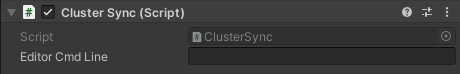
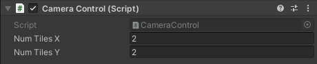
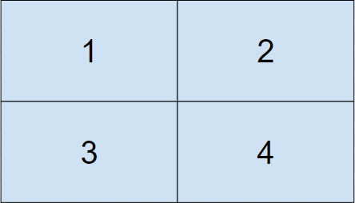

# Reference

## Cluster Display under the hood

### Synchronization method – lockstep

This synchronization method is known as frame locking, or “lockstep” synchronization. This means the master node will propagate an “update” signal with its internal state to all client nodes, signaling them to render a frame. The next “update” is not sent unless all clients reported the completion of their previous workload.

### Data payload synchronization

The data payload that gets synchronized between the master and client nodes each frame is constant, regardless of the number or complexity of objects in the scene. This means the complexity of the scene does not have an impact on network performance, only the individual rendering performance of each node.

### Communication phases and timeouts

The communication between the master and the clients happens in 2 phases:

1.  Initial handshake

2.  Ongoing synchronization

#### Handshake

-   The initial handshake occurs at startup between the master and each node:

    -   When the master node starts, it waits for the specified number of clients to connect.

    -   When the client nodes start, they advertise their presence and wait until a master accepts them into the cluster.

-   The handshake has a timeout of 30 seconds by default. You can change this value through a [command line argument](cluster-operation.md#timeout-arguments) when launching your application.

    -   The master node waits at most this amount of time for nodes to register and continues with the current set of nodes.

    -   The master node quits if no client nodes are present by the end of the timeout.

    -   The client nodes quit if no master node accepted them in a cluster after this amount of time.

#### Synchronization

-   After the initial handshake occurs, all nodes switch into a regular lockstep rendering phase that lasts until the end of the simulation.

-   The regular lockstep rendering phase has a timeout of 5 seconds by default. You can change this value through a [command line argument](cluster-operation.md#timeout-arguments) when launching your application.

    -   The master node waits this amount of time before kicking out an unresponsive node from the cluster.

    -   The client nodes wait this amount of time for an unresponsive master node before quitting.

    -   Typically, you should set the communication timeout a bit lower on the master node compared to the client nodes to prevent an avalanche quit phenomenon where the master node needs to kick out unresponsive nodes faster than the client node’s timeout.

## Available components

This section describes all components available in the Unity Editor for Cluster Display setup.

### Cluster Sync

The **Cluster Sync** component ensures the internal state synchronization and lockstep rendering.

Note that **Cluster Sync** requires specific command line arguments to function. For more details on those command line arguments, see [Launching the cluster](cluster-operation.md#starting-the-cluster).

For debugging purposes, you can run the Unity Editor as a cluster node. To do so, populate the **Editor Cmd Line** field on the **ClusterSync** component with the command line arguments that you would normally use to run a standalone build. Otherwise, you can leave this field blank. Note that if other cluster nodes fail to respond, the editor might hang.

### Camera Control

The **Camera Control** component is responsible for managing domain decomposition in projects that don’t use HDRP.

Typically, in that case, each rendering node maps its ID to a subsection of the global camera frustum. The **Camera Control** component is a script that implements the asymmetric frustum projection used in typical LED wall applications.

This component is a script that alters the main camera’s projection matrix to match the desired frustum. The parameters are the number of tiles along X and Y (2x2 by default). The tiles are ordered from left to right and top to bottom, as shown in the following example:

### Cluster Quit Behaviour

The **Cluster Quit Behaviour** component allows to cleanly quit the cluster.

When you have this component in your project:

-   You can press **Q** and **K** at the same time on the keyboard connected to the master when you need to manually quit the whole cluster.

-   The nodes can automatically quit the cluster if the [cluster communication times out](#communication-phases-and-timeouts).

## Tested Hardware

We have tested the solution with the hardware and configuration detailed below.

### Components

-   4 x [Supermicro SuperServer 1019GP-TT](https://www.supermicro.com/en/products/system/1U/1019/SYS-1019GP-TT.cfm)
    with:

    -   NVIDIA Quadro P6000 GPU

    -   NVIDIA Quadro Sync II Kit for Pascal Quadro

    -   1x Intel Xeon Gold 5122 3.6GHz Quad-Core Server CPU

    -   4x 16GB DDR4 2666Mhz ECC (64GB total)

    -   1x Samsung 970 Pro 512GB m.2 SSD

-   1x [Blackmagic Design MultiView 16](https://www.blackmagicdesign.com/ca/products/multiview/techspecs/W-MVW-01)

-   16x [Blackmagic Design Mini Converter SDI to HDMI 6G](https://www.blackmagicdesign.com/ca/products/miniconverters/techspecs/W-CONM-27https://www.blackmagicdesign.com/ca/products/miniconverters/techspecs/W-CONM-27)

-   16x [DisplayPort to HDMI cables](https://www.accellww.com/products/displayport-1-2-to-hdmi-2-0-adapter) (6ft)

-   16x SDI cables (6ft)

-   8x Cat 5 ethernet cables (6ft)

-   1x HDMI cable

-   1x Sony 55" 4K UHD HDR OLED Android Smart TV (XBR55A9G)

### Configuration

**OS**

-   Windows 10 Enterprise version 1903

**Network**

Every server is connected to two NICs (Network Interface Controller):

-   Build management (VM, copying and executing scripts)

-   Dedicated Cluster Display sync network

**Graphics Card**

-   Nvidia driver: 451.77

-   Resolution set to 1080p60.

-   Nvidia Sync Master set to the same machine as Cluster Display master cluster node

-   **NVIDIA Control Panel** settings set to recommended settings for NVIDIA Sync:

    -   **3D Settings > Manage 3D Settings > Global Preset** set to **Workstation App–Dynamic Streaming**

    -   **Vertical Sync** set to **Use the 3D Application Settings**. Note: must set Unity project to use V Sync

-   For the Nvidia Sync card setup, in the **Nvidia Control Pane**l:

    -   **Synchronize Display** set to **On this System** for the master sync server and set to **On Another System** on all clients

    -   Verify the display to sync is set correctly (currently only one display is used on all clients)

    -   Set the frame rate to 60Hz

-   For the ethernet sync connection, Nvidia recommends the following connection diagram:

    

-   Note that **daisy-chaining all servers from one port is not recommended**

-   Do not connect the NVIDIA Quadro Sync port to a switch; connections need to be machine-to-machine

**Multiviewer**

-   **Server Settings** in the **Nvidia Control Panel** of the master server set to **An External House Sync Signal**

>**Note:** Since both the Multiviewer and Nvidia Quadro Sync have reference input capability, we are using a tri-level sync generator from Black Magic to feed the reference signal to both the Multiviewer and Sync card. The tri-level sync is set to 59.94Hz.

>**Important:** To initialize the sync, or reinitialize after a reboot, all clients MUST be rebooted BEFORE the master sync server

-   Since we use a Multiviewer, every server is output through DisplayPort and then converted to HDMI. The HDMI signal then goes to a Black Magic Design mini-converter and converted to SDI which goes directly in the Multiviewer.
